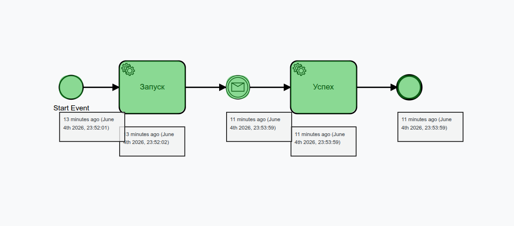
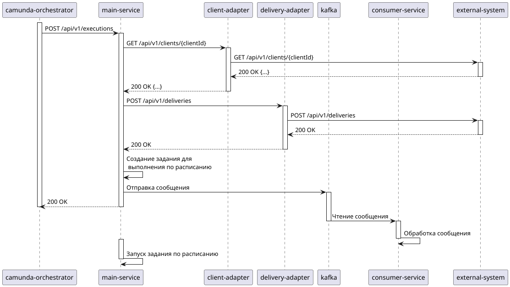
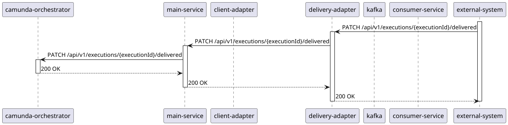
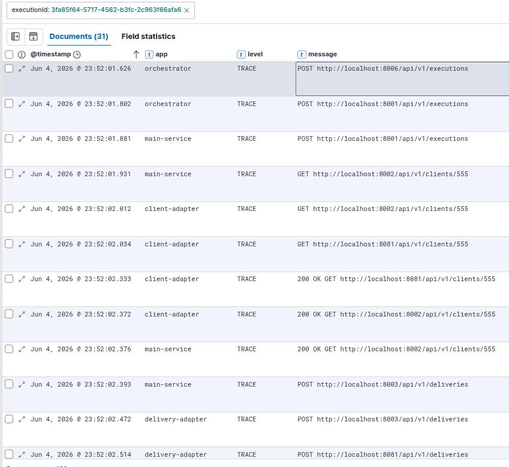
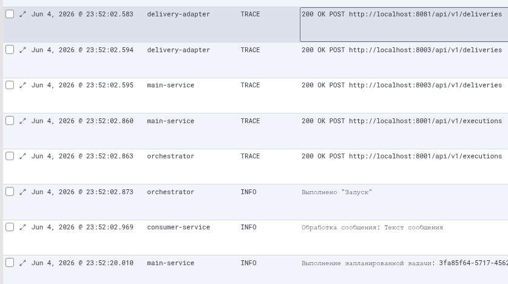
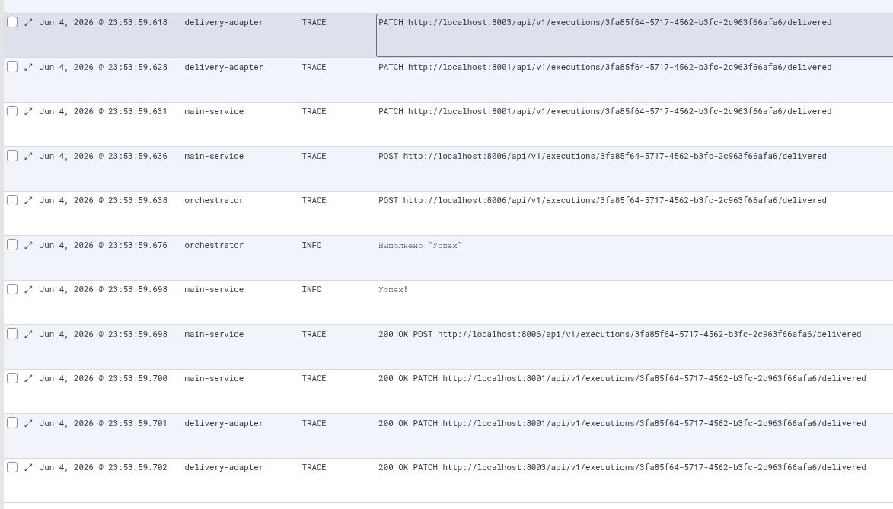

# Сквозные идентификаторы в логировании

Привет, Хабр! Я Евгений Шурупов, Backend Chapter Lead в ОТП Банке в кластере зарплатного проекта. Текущая статья — это развитие моей предыдущей [статьи](https://habr.com/ru/companies/otpbank/articles/923584/) о логировани в карточном конвейере. Для тех, кто её не читал, попробую изложить её главную суть кратко. У нас есть процессы на бекенде, растянутые во времени. Весь бекенд на spring-boot. Для разбора инцидентов, сбоев и прочего нужно прокидывать сквозные идентификаторы в логи. По одному из таких идентификаторов мы сможем увидеть все логи нужного нам процесса просто отфильтровав их по нужному значению поля этого идентификатора в логах. В статье описано решение, которое сейчас работает в конвейере. Таким образом мы видим все запросы, сообщения в кафку, информационные сообщения, если они случились в рамках нужного нам процесса, даже если он был растянут во времени на несколько недель. Далее, чтобы локализовать кусок процесса мы можем добавлять фильтры по имени сервиса, датам, типу сообщения и прочего, если это надо.

Я решил пойти дальше. Я переработал его и упаковал open-source библиотеку, которой может воспользоваться каждый из вас после прочтения статьи. Также вы можете помочь мне развивать эту библиотеку. Благо, развивать уже есть что и е есть куда. Если хотите дать совет, сказать, что вам нужно, что можно добавить в проект, или просто покритиковать, велком в комментарии.
Для тех, кто хочет не только прочитать, но и пощупать, как оно работает, сможете склонировать example-проект, про который расскажу тоже в этой статье.

## Немного начальной терминологии

Проект называется [logstamp](https://github.com/shurupov/logstamp). Такое название, потому что он добавляет отпечатки (stamps) процесса в лог (log). Каждый такой отпечаток это и есть сквозной идентификатор.

## Основные компоненты

За главную механику logstamp отвечают следующие три компонента:
* Контекст (StampContext)
* Извлекатель (StampExtractor)
* Перехватчик (Interceptor)
  * Приёмник (receiver)
  * Передатчик (transmitter)

Контекст находится в классе [StampContext](https://github.com/shurupov/logstamp/blob/main/logstamp-core-starter/src/main/java/io/github/shurupov/logstamp/core/StampContext.java). Он содержит контекст всех текущих отпечатков (stamps), актуальных для текущего потока выполнения. В него можно добавить идентификаторы, очистить контекст.

Перехватчик — это компонент, который встраивается в фреймворк приёма или передачи сообщения. Передатчик добавляет в сообщение (http-запрос или kafka-event) отпечатки. Приёмник вычитывает их из сообщения.

Извлекатель ([StampExtractor](https://github.com/shurupov/logstamp/blob/main/logstamp-core-starter/src/main/java/io/github/shurupov/logstamp/extractor/StampExtractor.java)) — компонент, который помогает перехватчику приёмнику вытаскивать отпечатки из входного сообщения. Есть интерфейс, для которого уже есть реализации. Но так же есть возможность реализовать в своём проекте для нестандартных случаев.

## Основная механика

В том месте кода, где отпечаток или сквозной идентификатор появляется первый раз, его надо добавить в контекст, вызвав метод [add(...)](https://github.com/shurupov/logstamp/blob/main/logstamp-core-starter/src/main/java/io/github/shurupov/logstamp/core/StampContext.java#L42-L45) бина `StampContext`. После этого отпечаток добавлен и в MDC-контекст, и собственно в контекст отпечатков для текущего потока выполнения. Когда сервис отправляет сообщение, например делает REST-запрос, срабатывает соответствующий перехватчик передатчик, который добавляет в сообщение отпечатки. В сервис, который получает сообщение, срабатывает перехватчик приёмник. Он берёт объект, который уже создал фреймворк, возможно, оборачивает его в какую-то обёртку, и передаёт всем, извлекателям, которые есть в контексте spring. Каждый извлекатель, смотря на объект, сначала определяет, может ли он извлечь из объекта отпечатки. Если может, то извлекает и отдаёт их перехватчику приёмнику. Перехватчик приёмник берёт их и добавляет в контекст. Таким образом, всё логирование, в рамках обработки этого сообщения будет уже содержать полученные отпечатки.

Для подключения этой основной механикий в зависимости проекта нужно добавить стартер `logstamp-core-starter`.

```xml
<dependency>
  <groupId>io.github.shurupov.logstamp</groupId>
  <artifactId>logstamp-core-starter</artifactId>
  <version>0.1.7</version>
</dependency>
```

Для подключения конкретных перехватчиков нужно будет подключать другие стартеры.

Также этот стартер содержит аннотацию `@AddStamps` и аспект, который оборачивает метод с ней. Это нужно для того, чтобы передать отпечатки в метод, который запускается там, где нет контекста. Например по расписанию. В случае, если у вас есть шедулер, который запускает обработки каких-то данных, чтобы иметь возможность фильтра логов этих обработок, стоит возпользоваться аннотацией. Но придётся написать извлекатель, который обрабатывает объект, переданный в метод.

## Пробрасывание отпечатков через http-запросы

Если вы делаете http-запросы внутри своего сервиса с помощью библиотеки `openfeign`, то вам нужно подключить стартер `logstamp-openfeign-starter`.

```xml
<dependency>
  <groupId>io.github.shurupov.logstamp</groupId>
  <artifactId>logstamp-openfeign-starter</artifactId>
  <version>0.1.7</version>
</dependency>
```

Он содержит [LogstampOpenfeignTransmitter](https://github.com/shurupov/logstamp/blob/main/logstamp-openfeign-starter/src/main/java/io/github/shurupov/logstamp/interceptor/transmitter/LogstampOpenfeignTransmitter.java), который берёт отпечатки из контекста и кладёт их в http заголовки запроса. По дороге имена отпечатков преобразует из camelCase в kebab-case. А также добавляет в имя префикс `x-stamp-`. Впрочем префикс можно изменить в настройках приложения.

Для того, чтобы получатель запроса обработал эти заголовки, нужно подключить стартер `logstamp-servlet-starter`.

```xml
<dependency>
  <groupId>io.github.shurupov.logstamp</groupId>
  <artifactId>logstamp-servlet-starter</artifactId>
  <version>0.1.7</version>
</dependency>
```

Он содержит [ExtractStampReceiver](https://github.com/shurupov/logstamp/blob/main/logstamp-servlet-starter/src/main/java/io/github/shurupov/logstamp/interceptor/receiver/ExtractStampReceiver.java). Это реализация фильтра spring для обработки http-запросов. Она оборачивает `HttpServletRequest` в `CachedBodyHttpServletRequest` и передаёт его в метод `addIdentifiers` контекста отпечатков `StampContext`. Где как раз и вызываются все извлекатели. Здесь же лежит извлекатель `DefaultHttpRequestStampExtractor`, который извлекает из заголовков отпечатки.

На случай, если надо извлечь отпечаток из http заголовка нестандартно, можно реализовать интерфейс [HttpRequestStampExtractor](https://github.com/shurupov/logstamp/blob/main/logstamp-servlet-starter/src/main/java/io/github/shurupov/logstamp/extractor/HttpRequestStampExtractor.java). Он в свою очередь наследует основной интерфейс `StampExtractor`.

Примером может быть случай, когда система ожидает колбек из внешней системы. Например, когда вы запустили доставку, а потом получаете колбек из службы доставки о статусе доставки, который порождает продолжение процесса. Запрос из внешней системы не содержит заголовков с отпечатками, которые обработаются стандартно. Поэтому надо написать нестандартный извлекатель, для вытаскивания идентификатора из запроса.

На случай асинхронной обработки запроса, т.е. обработки методов с аннотацией `@Async` также есть обработки проброса контекста в нужный поток. Подробно описывать не буду. Можете посмотреть на github.

## Пробрасывание отпечатков через kafka

Если в вашем процессе есть kafka, то вам нужно также подключить `logstamp-kafka-starter`.

```xml
<dependency>
  <groupId>io.github.shurupov.logstamp</groupId>
  <artifactId>logstamp-kafka-starter</artifactId>
  <version>0.1.7</version>
</dependency>
```

Он содержит:
 * [KafkaStampTransmitter](https://github.com/shurupov/logstamp/blob/main/logstamp-kafka-starter/src/main/java/io/github/shurupov/logstamp/interceptor/transmitter/KafkaStampTransmitter.java) перехватчик передатчик отпечатков
 * [KafkaStampReceiver](https://github.com/shurupov/logstamp/blob/main/logstamp-kafka-starter/src/main/java/io/github/shurupov/logstamp/interceptor/receiver/KafkaStampReceiver.java) перехватчик приёмник отпечатков
 * [KafkaConsumerStampExtractor](https://github.com/shurupov/logstamp/blob/main/logstamp-kafka-starter/src/main/java/io/github/shurupov/logstamp/extractor/KafkaConsumerStampExtractor.java) стандартный извлекатель отпечатков. Передатчик добавляет в заголовки сообщения отпечатки. А извлекатель `KafkaConsumerStampExtractor` извлекает их из этих заголовков.

Но если из кафки читается сообщение, которое писал не ваш сервис, то можно написать свой извлекатель, который вытащит отпечатки из тела сообщения. Или даже вытащит из тела внешний идентификатор, по которому найдёт у себя в базе данных нужное значение отпечатка.

## Camunda

Проект, где зародилась идея этой библиотеки был карточный конвейер, сердце которого — оркестратор на camunda (версии 7). В camunda куски процесса лежат в так называемых делегатах, которые могут быть запущены по таймеру, событию, ретраю, т.е. вне рамок потока, который стартанул процесс. Это значит, что тут тоже нужно продумать процесс доведения до каждого делегата отпечатков. Изначально это было сделано через абстрактный класс делегата. Но сейчас сделано решение, для работы которого тоже достаточно подключить соответствующий стартер.

```xml
<dependency>
  <groupId>io.github.shurupov.logstamp</groupId>
  <artifactId>logstamp-camunda7-starter</artifactId>
  <version>0.1.7</version>
</dependency>
```

Он содержит перехватчик (interceptor) уже в терминах camunda который добавляет переменную процесса, куда кладёт отпечатки из контекста текущего процесса. Это нужно в самом начале процесса, чтобы закрепить отпечатки за процессом. Также, если в процессе отпечатки добавляются, они добавляются и в переменную. Также перед запуском каждого делегата, перехватчик достаёт все имеющиеся отпечатки из переменной процесса в контекст.

## Пример использования

Рассмотрим условный бизнес-процесс с доставкой, проходящий через несколько сервисов. 
При старте процесса создаётся сущность исполнение (execution), у которой есть идентификатор `executionId`, проходящий через весь процесс.
Сервисы взаимодействуют между собой посредством HTTP и kafka. 
Также один из сервисов запускает внутри себя по расписанию выполнение некоторых задач, которые создаются в рамках процесса.
Процесс оркестрируется сервисом на фреймфорке camunda версии 7.

Вот bpmn-схема процесса в camunda.



Процесс состоит из двух частей.

Первая: процесс стартует и отправляет запрос на старт доставки.



Вторая: начинается с колбека от сервиса доставки.



### Сервисы:
* camunda-orchestrator - оркестратор
* main-service - сервис с основной бизнес-логикой. Принимает запросы от оркестратора, делает запросы в адаптеры, принимает колбеки от адаптеров, пишет в кафку, запускает шедулер внутри себя.
* client-adapter - адаптер взаимодействует с системой, хранящей данные клиентов
* delivery-adapter - адаптер взаимодействует с системой доставки
* kafka
* consumer-service - некоторый сервис, который обрабатывает сообщения из кафки
* external-service - заглушка, которая изображает внешние системы (клиенты, доставка)

Суть процесса обозначена на диаграммах последовательностей выше. Нам нужно, чтобы при условии, что таких процессов происходит много одновременно, как-то отфильтровать логи, чтобы увидеть конкретный процесс, зная его главный идентификатор executionId.

Подключаем в наши сервисы нужные зависимости: 
* logstamp-core-starter подключаем везде,
* там где есть обработка запросов - logstamp-servlet-starter,
* где есть отправка запросов с помощью openfeign подключаем logstamp-openfeign-starter,
* где кафка, там logstamp-kafka-starter,
* где camunda, там logstamp-camunda7-starter.

Во входящем стартовом запросе приходит `executionId`. Мы его извлекаем и кладём в контекст с помощью реализации интерфейса `HttpRequestStampExtractor`. Он также может не прийти, тогда создаём его и добавляем в контекст прямо в коде обработки запроса. Далее в сервисы он передаётся автоматически без дополнительных настроек или кода.

Внутри `main-service` есть задание, выполняющееся по расписанию. Чтобы отпечаток добавился в него, метод, который принимает объект задания помечаем аннотацией `@AddStamps(initiator = "scheduler")` и создаём `JobExtractor`, реализующий `StampExtractor`, который извлекает `executionId` из задания.

После того как доставка успешно завершена, в `delivery-adapter` приходит колбек от `external-system`. Внешняя система ничего не знает о наших отпечатках и не прокидывает нужные http-заголовки. Но запрос о доставке содержит `executionId`. Поэтому пишем `FromDeliveryIdentifierExtractor`, реализующий `HttpRequestStampExtractor`, который извлекает `executionId`.

Теперь всё настроено. Прогоняем процесс и фильтруем логи по `executionId`. Получаем:





Таким образом, зная значение одного сквозного идентификатора, мы можем отфильтровать логи, и увидеть весь процесс, проходящий через все сервисы системы. Работает также с растянутым во времени процессе. Например, с доставкой, которая может происходить от 2 минут до нескольких недель. Т.е. это не помешает нам увидеть весь процесс.

Сам проект, напомню, находится на github по ссылке https://github.com/shurupov/logstamp. Тестовый проект, демонстрирующий библиотеку лежит рядом https://github.com/shurupov/logstamp-example

Сейчас реализованы стартеры, указанные выше. В планах добавить поддержку rabbbitmq, grpc и другие способы межсервисных взаимодействий. И вы можете в этом поучаствовать.